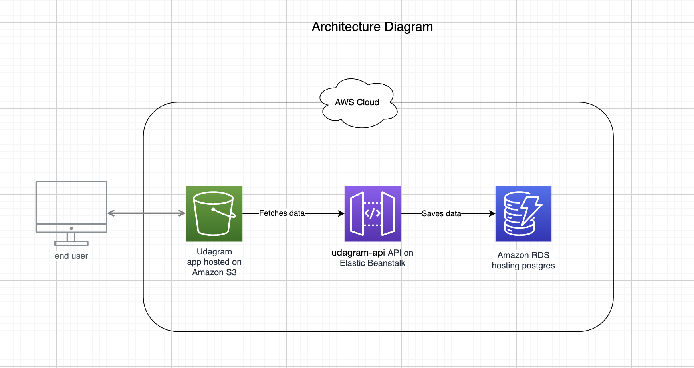

### Infrastructure

An IAM user is created to allow CLI access to the Amazon Elastic Beanstalk and used to perform the deployment via the automatic deployment job of CircleCI during the continuous integration/continuous deployment process.
A postgres relational database is hosted on the Amazon RDS service for the storage of data.
The NodeJS/express API application (backend) is deployed in the Amazon Elastic Beanstalk service.
The Angular web application Udagram (frontend) is deployed in an Amazon S3 bucket.
The web application communicates with the RESTful API via HTTP requests.
