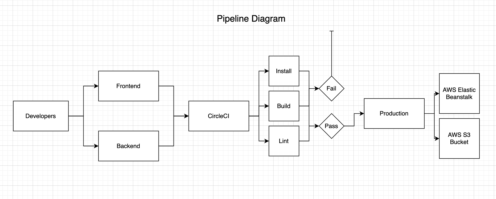

### Pipeline

CircleCI offers pipeline as a service, these pipelines are executed on events that happen in GitHub

- CircleCI project is created using the GitHub repository containing the .circleci/congif.yml file
- CI/CD pipelines will be triggered automatically when commits/pushes are made to repo.

